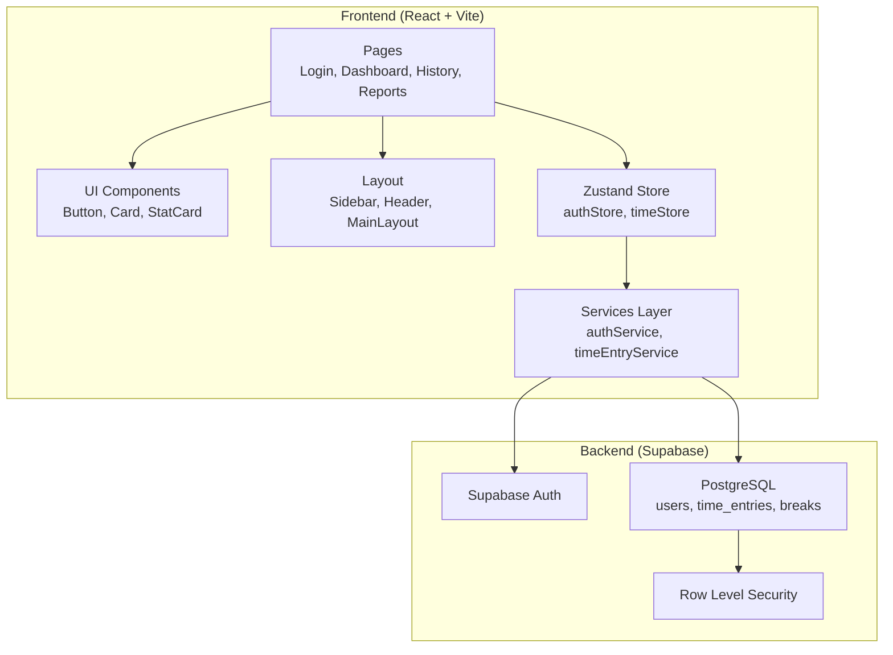

# Control Horario - Plan de Implementación

Desarrollo de una aplicación web moderna de control y gestión de horarios laborales basada en el documento SRS y el diseño visual proporcionado (`diseño.png`).

## User Review Required

> [!IMPORTANT]
> **Configuración de Supabase requerida**: Antes de ejecutar la aplicación, necesitarás proporcionar las credenciales de Supabase (`VITE_SUPABASE_URL` y `VITE_SUPABASE_ANON_KEY`). ¿Ya tienes un proyecto Supabase configurado o debo incluir instrucciones para crearlo?

> [!NOTE]
> El diseño se adapta al mockup `diseño.png` con paleta verde lima (#CCFF00) y negro, manteniendo la estética premium moderna.

---

## Proposed Changes

### 1. Configuración del Proyecto

#### [NEW] [package.json](file:///c:/Users/Asus/OneDrive%20-%20CORPORACIÓN%20XIX%20JUEGOS%20PANAMERICANOS%20SANTIAGO%202023/Escritorio/PitiN/Antigravity/AppControlHorario/package.json)
Proyecto Vite + React con dependencias:
- `react`, `react-dom`, `react-router-dom`
- `@supabase/supabase-js` - Cliente Supabase
- `zustand` - Estado global
- `recharts` - Gráficos
- `date-fns` - Manejo de fechas
- `lucide-react` - Iconos

#### [NEW] [vite.config.js](file:///c:/Users/Asus/OneDrive%20-%20CORPORACIÓN%20XIX%20JUEGOS%20PANAMERICANOS%20SANTIAGO%202023/Escritorio/PitiN/Antigravity/AppControlHorario/vite.config.js)
Configuración de Vite para React.

---

### 2. Sistema de Diseño

#### [NEW] [src/index.css](file:///c:/Users/Asus/OneDrive%20-%20CORPORACIÓN%20XIX%20JUEGOS%20PANAMERICANOS%20SANTIAGO%202023/Escritorio/PitiN/Antigravity/AppControlHorario/src/index.css)
Tokens de diseño basados en el mockup:
```css
:root {
  /* Colors - Basado en diseño.png */
  --color-primary: #CCFF00;      /* Verde lima */
  --color-surface: #1A1A1A;       /* Negro/dark */
  --color-surface-light: #2A2A2A;
  --color-background: #E8F5E8;    /* Verde claro fondo */
  --color-text: #FFFFFF;
  --color-text-muted: #888888;
  --color-accent-purple: #A855F7;
  
  /* Spacing */
  --spacing-xs: 0.25rem;
  --spacing-sm: 0.5rem;
  --spacing-md: 1rem;
  --spacing-lg: 1.5rem;
  --spacing-xl: 2rem;
  
  /* Border Radius */
  --radius-sm: 0.5rem;
  --radius-md: 1rem;
  --radius-lg: 1.5rem;
  --radius-full: 9999px;
}
```

---

### 3. Capa de Servicios (Wrapper Supabase)

#### [NEW] [src/lib/supabase.js](file:///c:/Users/Asus/OneDrive%20-%20CORPORACIÓN%20XIX%20JUEGOS%20PANAMERICANOS%20SANTIAGO%202023/Escritorio/PitiN/Antigravity/AppControlHorario/src/lib/supabase.js)
Cliente Supabase encapsulado para agnosticismo de dependencias.

#### [NEW] [src/services/authService.js](file:///c:/Users/Asus/OneDrive%20-%20CORPORACIÓN%20XIX%20JUEGOS%20PANAMERICANOS%20SANTIAGO%202023/Escritorio/PitiN/Antigravity/AppControlHorario/src/services/authService.js)
Servicios de autenticación: `login`, `register`, `logout`, `getCurrentUser`.

#### [NEW] [src/services/timeEntryService.js](file:///c:/Users/Asus/OneDrive%20-%20CORPORACIÓN%20XIX%20JUEGOS%20PANAMERICANOS%20SANTIAGO%202023/Escritorio/PitiN/Antigravity/AppControlHorario/src/services/timeEntryService.js)
Servicios de registros horarios: `clockIn`, `clockOut`, `getEntries`, `getTodayEntry`.

#### [NEW] [src/services/breakService.js](file:///c:/Users/Asus/OneDrive%20-%20CORPORACIÓN%20XIX%20JUEGOS%20PANAMERICANOS%20SANTIAGO%202023/Escritorio/PitiN/Antigravity/AppControlHorario/src/services/breakService.js)
Servicios de pausas: `startBreak`, `endBreak`, `getBreaks`.

---

### 4. Estado Global

#### [NEW] [src/store/authStore.js](file:///c:/Users/Asus/OneDrive%20-%20CORPORACIÓN%20XIX%20JUEGOS%20PANAMERICANOS%20SANTIAGO%202023/Escritorio/PitiN/Antigravity/AppControlHorario/src/store/authStore.js)
Store Zustand para estado de autenticación.

#### [NEW] [src/store/timeStore.js](file:///c:/Users/Asus/OneDrive%20-%20CORPORACIÓN%20XIX%20JUEGOS%20PANAMERICANOS%20SANTIAGO%202023/Escritorio/PitiN/Antigravity/AppControlHorario/src/store/timeStore.js)
Store para estado de jornada actual y estadísticas.

---

### 5. Componentes de UI

#### [NEW] [src/components/ui/Button.jsx](file:///c:/Users/Asus/OneDrive%20-%20CORPORACIÓN%20XIX%20JUEGOS%20PANAMERICANOS%20SANTIAGO%202023/Escritorio/PitiN/Antigravity/AppControlHorario/src/components/ui/Button.jsx)
Botón reutilizable con variantes (primary, secondary, danger).

#### [NEW] [src/components/ui/Card.jsx](file:///c:/Users/Asus/OneDrive%20-%20CORPORACIÓN%20XIX%20JUEGOS%20PANAMERICANOS%20SANTIAGO%202023/Escritorio/PitiN/Antigravity/AppControlHorario/src/components/ui/Card.jsx)
Card con estilos del diseño (bordes redondeados, sombras).

#### [NEW] [src/components/ui/StatCard.jsx](file:///c:/Users/Asus/OneDrive%20-%20CORPORACIÓN%20XIX%20JUEGOS%20PANAMERICANOS%20SANTIAGO%202023/Escritorio/PitiN/Antigravity/AppControlHorario/src/components/ui/StatCard.jsx)
Card de estadísticas como en el diseño (Energy Used, Heart Rate, etc.).

#### [NEW] [src/components/ui/Input.jsx](file:///c:/Users/Asus/OneDrive%20-%20CORPORACIÓN%20XIX%20JUEGOS%20PANAMERICANOS%20SANTIAGO%202023/Escritorio/PitiN/Antigravity/AppControlHorario/src/components/ui/Input.jsx)
Input estilizado para formularios.

---

### 6. Layout y Navegación

#### [NEW] [src/components/layout/Sidebar.jsx](file:///c:/Users/Asus/OneDrive%20-%20CORPORACIÓN%20XIX%20JUEGOS%20PANAMERICANOS%20SANTIAGO%202023/Escritorio/PitiN/Antigravity/AppControlHorario/src/components/layout/Sidebar.jsx)
Sidebar oscuro como en el diseño con:
- Logo "flux" → "Control Horario"
- Navegación (Dashboard, Home, Reportes, Historial, Mensajes)
- Card de upgrade

#### [NEW] [src/components/layout/Header.jsx](file:///c:/Users/Asus/OneDrive%20-%20CORPORACIÓN%20XIX%20JUEGOS%20PANAMERICANOS%20SANTIAGO%202023/Escritorio/PitiN/Antigravity/AppControlHorario/src/components/layout/Header.jsx)
Header con perfil de usuario, búsqueda y notificaciones.

#### [NEW] [src/components/layout/MainLayout.jsx](file:///c:/Users/Asus/OneDrive%20-%20CORPORACIÓN%20XIX%20JUEGOS%20PANAMERICANOS%20SANTIAGO%202023/Escritorio/PitiN/Antigravity/AppControlHorario/src/components/layout/MainLayout.jsx)
Layout principal que combina Sidebar + Header + contenido.

---

### 7. Páginas

#### [NEW] [src/pages/Login.jsx](file:///c:/Users/Asus/OneDrive%20-%20CORPORACIÓN%20XIX%20JUEGOS%20PANAMERICANOS%20SANTIAGO%202023/Escritorio/PitiN/Antigravity/AppControlHorario/src/pages/Login.jsx)
Página de inicio de sesión con diseño premium.

#### [NEW] [src/pages/Register.jsx](file:///c:/Users/Asus/OneDrive%20-%20CORPORACIÓN%20XIX%20JUEGOS%20PANAMERICANOS%20SANTIAGO%202023/Escritorio/PitiN/Antigravity/AppControlHorario/src/pages/Register.jsx)
Página de registro de nuevos usuarios.

#### [NEW] [src/pages/Dashboard.jsx](file:///c:/Users/Asus/OneDrive%20-%20CORPORACIÓN%20XIX%20JUEGOS%20PANAMERICANOS%20SANTIAGO%202023/Escritorio/PitiN/Antigravity/AppControlHorario/src/pages/Dashboard.jsx)
Dashboard principal con:
- Título "Control Horario Overview"
- Cards de estadísticas (Horas Hoy, Horas Semana, Horas Mes, Estado Actual)
- Gráfico de actividad semanal/mensual
- Botones de marcaje (Entrada/Salida/Pausa)

#### [NEW] [src/pages/History.jsx](file:///c:/Users/Asus/OneDrive%20-%20CORPORACIÓN%20XIX%20JUEGOS%20PANAMERICANOS%20SANTIAGO%202023/Escritorio/PitiN/Antigravity/AppControlHorario/src/pages/History.jsx)
Historial de jornadas con filtros y paginación.

#### [NEW] [src/pages/Reports.jsx](file:///c:/Users/Asus/OneDrive%20-%20CORPORACIÓN%20XIX%20JUEGOS%20PANAMERICANOS%20SANTIAGO%202023/Escritorio/PitiN/Antigravity/AppControlHorario/src/pages/Reports.jsx)
Reportes visuales con gráficos de horas trabajadas.

---

### 8. Configuración de Rutas

#### [NEW] [src/App.jsx](file:///c:/Users/Asus/OneDrive%20-%20CORPORACIÓN%20XIX%20JUEGOS%20PANAMERICANOS%20SANTIAGO%202023/Escritorio/PitiN/Antigravity/AppControlHorario/src/App.jsx)
Componente principal con React Router y rutas protegidas.

#### [NEW] [src/main.jsx](file:///c:/Users/Asus/OneDrive%20-%20CORPORACIÓN%20XIX%20JUEGOS%20PANAMERICANOS%20SANTIAGO%202023/Escritorio/PitiN/Antigravity/AppControlHorario/src/main.jsx)
Entry point de la aplicación.

---

## Diagrama de Arquitectura



---

## Verification Plan

### Pruebas en Navegador

1. **Build y Dev Server**
   ```bash
   cd "c:\Users\Asus\OneDrive - CORPORACIÓN XIX JUEGOS PANAMERICANOS SANTIAGO 2023\Escritorio\PitiN\Antigravity\AppControlHorario"
   npm install
   npm run dev
   ```
   Verificar que el servidor inicie sin errores en http://localhost:5173

2. **Verificación Visual**
   - Abrir http://localhost:5173 en el navegador
   - Verificar que el diseño coincide con `diseño.png`
   - Verificar navegación entre páginas
   - Verificar responsividad (desktop/tablet/móvil)

3. **Flujo de Autenticación** (requiere Supabase configurado)
   - Probar registro de nuevo usuario
   - Probar login con credenciales
   - Verificar redirección a dashboard
   - Probar logout

4. **Funcionalidad de Marcaje** (requiere Supabase configurado)
   - Marcar entrada
   - Verificar actualización de estado
   - Marcar pausa
   - Marcar salida
   - Verificar cálculo de horas

### Manual Testing

> [!NOTE]
> Para pruebas completas con Supabase necesitaré que me proporciones las credenciales del proyecto o que verifiques manualmente la integración.
